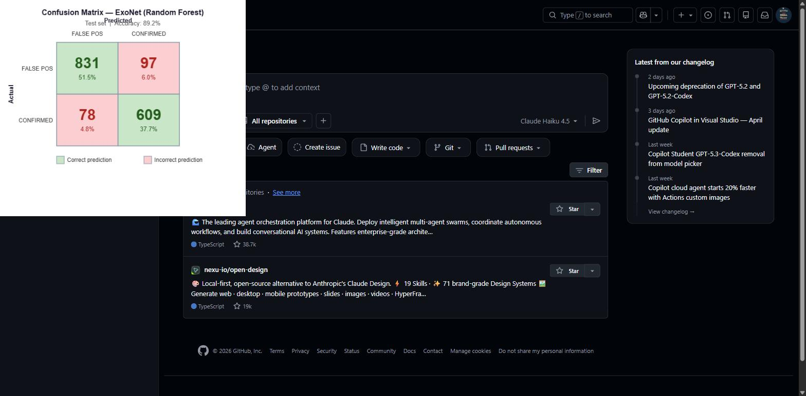

# ExoNet

Final project for ITAI 2372 (Implementation track).

Author: Trilok, Group 01 (solo)
Date: April 2026

## What this is

ExoNet is a small machine learning project that takes data from NASA's Kepler
mission and tries to decide whether each candidate signal is a real exoplanet
("CONFIRMED") or a false positive. It's a basic supervised classification
problem with about 7,500 labeled rows after I clean things up.

The data comes from the Kepler Object of Interest (KOI) cumulative table on
the NASA Exoplanet Archive. I use ten features that describe the orbit, the
candidate planet itself, and the host star. The model is a Random Forest from
scikit-learn.

If the NASA archive isn't reachable when you run the code (offline grading,
firewall, etc.), the loader prints a warning and falls back to a synthetic
dataset so the pipeline still runs. The numbers in that case won't be
scientifically meaningful but it lets the rest of the code execute.

## Folders

```
src/        all the Python code
tests/      pytest tests
docs/       proposal, testing plan, design notes
data/       created at runtime, gitignored
notebooks/  scratch space
```

## Running it

You need Python 3.10 or newer.

```
python -m venv .venv
source .venv/bin/activate  # or .venv\Scripts\activate on Windows
pip install -r requirements.txt
```

Then to train and see the metrics:

```
python -m src.main train
```

To predict on a single new candidate (these are roughly the parameters for
Kepler-22b):

```
python -m src.main predict --koi-period 9.488 --koi-duration 2.95 \
  --koi-depth 615.8 --koi-prad 2.26 --koi-teq 793 --koi-insol 93.59 \
  --koi-model-snr 35.8 --koi-steff 5455 --koi-slogg 4.467 --koi-srad 0.927
```

To run the tests:

```
pytest -v
```

## Results

The Random Forest classifier achieves **~89% accuracy** on the held-out test set.



The model is better at catching false positives than confirmed planets — a
reasonable trade-off for a first pass where flagging bad candidates matters
more than missing a few real ones.

## Documentation

The 20-point proposal is in `docs/proposal.pdf`. The 25-point testing plan is
in `docs/testing_plan.pdf`. Other notes (architecture, usage details, the
feature list and what each one means) are in `docs/` as markdown files. The
final presentation slides are at `presentation.pdf` in the repo root.

## Citation

NASA Exoplanet Archive, Kepler Objects of Interest (Cumulative). Operated by
Caltech under contract with NASA. Accessed April 2026.
